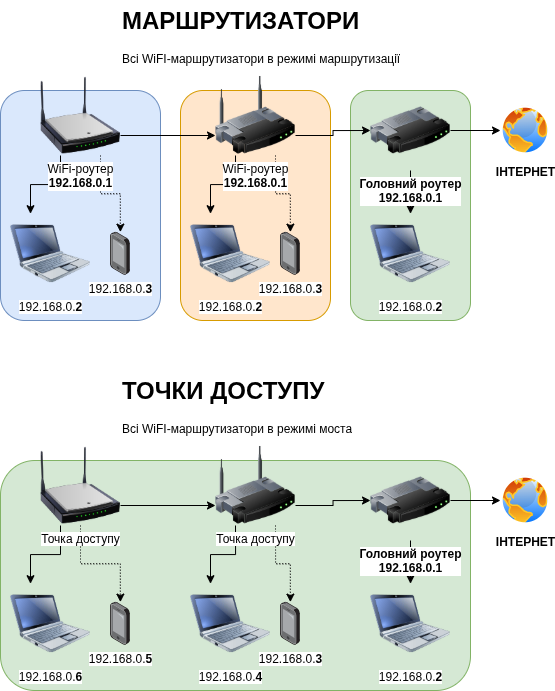
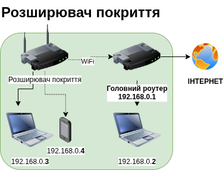
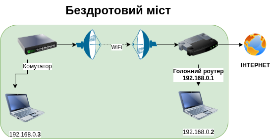
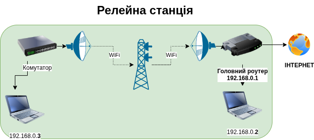
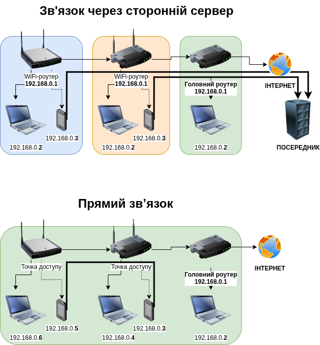

# Точки доступу

## Визначення

Маршрутизатор (router, роутер) може працювати так само як комутатор (switch, свіч), коли потрібно *розширити локальну мережу*. В загальному такий режим роботи називається «**міст**» (bridge, брідж), а для мережі WiFi — «**точка доступу**» до мережі (Access Point, акцес поінт).

Якщо точка доступу підключена до основного маршрутизатора не по кабелю, а *по WiFi*, то її називають «**розширювач покриття WiFi**» (WiFi range extender, вайфай ренж екстендер).

Якщо сигнал WiFi передається лише між двома *комутаторами*, а звичайні абоненти підключитися не можуть, то це називається «**бездротовий міст**» (wireless bridge, ваєрлес брідж).

Якщо в бездротовому мості по середині включений розширювач WiFi, то його називають «**релейна станція**» (relay, релей).

Хоча ці пристрої *називаються по різному*, це все — *бездротові точки доступу* до мережі, і до них можна підʼєднуватися при допомозі ноутбуків, телефонів, чи такого ж самого обладнання. Далекобійні точки доступу, такі наприклад як AirFiber, які можуть передавати сигнал WiFi на кілька кілометрів, потребують сильного захисту мережі (**WPA3, AES256**), довгих і складних унікальних паролів, та використання VPN при передачі трафіку.

## Для чого?

Щоб всі абоненти в мережі могли працювати один з одним та головним роутером *напряму*. Коли абоненти не можуть звʼязатися напряму, вони змушені використовувати *сторонні сайти* в інтернеті для передачі даних, що *погано для безпеки* та для швидкості звʼязку.

## Що це таке?

Точка доступу бере сигнал із дротового кабелю (від комутатора або маршрутизатора) і перетворює його на Wi-Fi, щоб ваш телефон, ноутбук або планшет могли працювати в мережі, не маючи фізичного підключення кабелем. На відміну від маршрутизатора, точка доступу не створює свою власну локальну мережу, а лише **розширює локальну мережу** основного маршрутизатора.

## Як вона працює?

1. **Отримує підключення по кабелю:** Точка доступу підключена кабелем до вашої мережі (зазвичай до комутатора або основного маршрутизатора).
2. **Отримує мережу WiFi:** На точці доступу налаштовується мережа WiFi та вмикається режим точки доступу.
3. **Приймає чи передає сигнали по WiFi:** Спілкується з абонентами по WiFi.
4. **Приймає та передає дані по кабелю:** Спілкується з основним маршрутизатором по кабелю.

### Чим точка доступу відрізняється від маршрутизатора?

* **Маршрутизатор (Router):** Це «мозок» мережі. Він керує адресами, розподіляє інтернет і з'єднує вас із зовнішнім світом. Більшість домашніх маршрутизаторів — це комбіновані пристрої (маршрутизатор + комутатор + NAT + фаєрвол + точка доступу в одному корпусі).
* **Точка доступу (Access Point):** Це лише «розширювач» бездротового покриття. Вона не вміє керувати мережею або роздавати інтернет самостійно — їй обов'язково потрібен маршрутизатор, щоб мати доступ до Інтернет.
