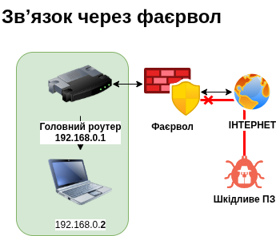
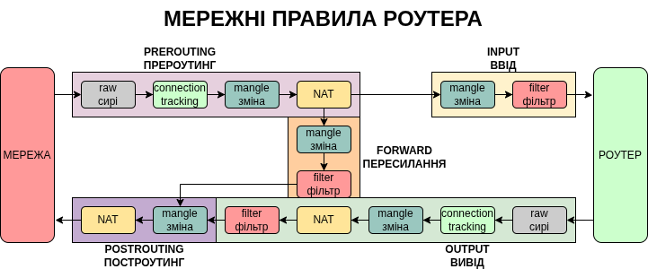

# Фаєрволи (Firewalls)

## Що це таке?

Якщо комутатор — це перехрестя, а маршрутизатор — це регулювальник на перехресті, то **фаєрвол (firewall)** — це блокпост на дорозі.

Фаєрвол, або брандмауер (стіна для захисту від поширення вогню) — це "фільтр" або "контрольно-пропускний пункт", який перевіряє весь трафік (дані), що намагається увійти у вашу мережу або вийти з неї. Він вирішає, кому можна проходити, а кого потрібно зупинити.

Існують різні типи фаєрволів, від найпростіших, які просто перевіряють номера, до складних з глибокою перевіркою пакетів (DPI, Deep Packet Inspection) на загрози, які вимагають високої потужності пристрою та значно сповільнюють мережу. Якщо звичайний фаєрвол — це блокпост, то DPI — це митниця.

## Як він працює?

Фаєрвол працює на основі набору правил (інструкцій), які ви йому надаєте. Наприклад:

1. **"Дозволити все, що приходить від нашого офісу"**: Фаєрвол бачить, що дані йдуть від перевіреного джерела, і пропускає їх.
2. **"Заборонити будь-які спроби підключення з невідомих сайтів"**: Якщо хтось із інтернету намагається "постукати" у ваш комп'ютер без вашого дозволу, фаєрвол просто блокує його запит.

Ці правила записуються в таблицю фільтрів (filter) у відповідні ланцюжки, такі як FORWARD (пересилання пакетів між мережами), INPUT (вхідні пакети до самого роутера), та OUTPUT (вихідні пакети від роутера) .

## Основні типи фаєрволів:

* **Програмні (Software Firewalls):** Встановлюються прямо на ваш комп'ютер (наприклад, Windows Defender). Вони захищають лише один пристрій.
* **Апаратні (Hardware Firewalls):** Це окремі фізичні фаєрволи або маршрутизатори, які стоять на вході в усю вашу мережу. Вони захищають відразу всі пристрої у вашій мережі.
* **Апаратні з глибокою перевіркою:** Це окремі фізичні пристрої, які вміють перевіряти вміст пакетів та зʼєднань, але вони дуже дорогі та їх складно налаштувати.

## Чому він важливий?

Без фаєрволу мережа була б відкрита для будь-якої атаки з інтернету. Віруси чи хакери можуть автоматично шукати в мережі вразливі пристрої та підбирати до них паролі чи використовувати вразливості, і фаєрвол — це перший і найголовніший захист від таких спроб.

## Яка відмінність між фаєрвол та NAT?

Міжмережний фаєрвол *захищає* локальну мережу від зовнішніх загроз, тоді як NAT (Network Address Translation, підміна мережних адрес) *приховує адреси* абонентів локальної мережі, так що весь трафік йде з єдиної адреси роутера.

## Які основні режими фаєрволів?

Для офісного роутера — заборонити доступ від усіх зовнішніх адрес до внутрішніх компʼютерів, дозволити внутрішнім компʼютерам доступ до всього інтернету КРІМ декількох небезпечних сайтів.

Для релеїв — заборонити доступ до всіх компʼютерів крім тих, куди передається трафік. (Звʼязок точка-точка).

Для фаєрвола, який захищає сервер — дозволити доступ від усіх компʼютерів але тільки на один порт сервера.

Для точки VPN — дозволити доступ з усіх компʼютерів, але тільки на порт VPN.
