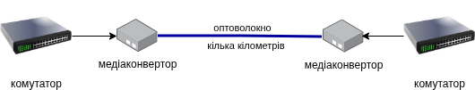

# Медіаконвертори

### Що це таке?
Якщо ви спробуєте під'єднати звичайний кабель від комп'ютера до оптоволокна, вони просто не зможуть «говорити» одне з одним, бо використовують різні мови (світло замість електрики). **Медіаконвертор**  (media converter, перетворювач носія)— це пристрій-перекладач, який дозволяє поєднувати різні типи кабелів.

Простими словами: медіаконвертор перетворює електричний сигнал із мідного кабелю (наприклад, звичайного Ethernet-кабелю) на світловий сигнал для оптоволокна, і навпаки. Це дозволяє передавати дані на дуже великі відстані, де звичайний кабель уже не працює.

### Як він працює?
1. **Отримує сигнал:** Пристрій приймає електричний сигнал від мережевої карти або комутатора через звичайний кабель (RJ-45).
2. **Перетворює сигнал:** Внутрішня електроніка медіаконвертора перетворює цей електричний сигнал у світлові імпульси.
3. **Відправляє світло:** Ці імпульси надсилаються через оптичне волокно на велику відстань.
4. **Зворотний процес:** Коли дані йдуть у зворотному напрямку, конвертор робить все навпаки: перетворює світло з оптоволокна назад у електрику для звичайного кабелю.

### Навіщо вони потрібні?
* **Велика відстань:** Звичайний мідний кабель (Ethernet) працює лише до 100 метрів. Оптоволокно може працювати на кілометри. Медіаконвертор дозволяє «продовжити» мережу дуже далеко.
* **Економія:** Замість того, щоб купувати дорогий оптоволоконний комутатор, можна просто поставити дешевий медіаконвертор там, де потрібно підключити один пристрій до оптики.
* **Простота:** Медіаконвертер не потребує ніяких налаштувань. Він працює відразу після підключення.

## Варіанти

Оптичні медіаконвектори бувають різних стандартів:

* Для одномодового волокна (singlemode, на кілометри чи десятки кілометрів), або для багатомодового волокна (multimode, на сотні метрів).
* На 100 Мбіт, 1 Гбіт, 2.5Гбіт, 10Гбіт.
* З дуплексними розʼємами (на два кабелі), які працюють на одній довжині хвилі (застаріли), або з одинарним розʼємом, які використовують різні довжини хвиль по одному кабелю (WDM, Wavelength Division Multipulation, мультиплікація передачі розділенням довжнин хвиль).
* З розʼємами SC чи LC (менші) та сколом прями (UPC, сині) чи скошеним (APC, зелені). Голубий розʼєм SC/UPC зараз є стандартом, але LC менші за розміром і скошений скол APC дає менші втрати що збільшує дальність звʼязку.

Зараз найпопулярніші медіаконвертори — **WDM для одномодового кабеля** на 100 Мбіт чи 1 Гбіт з дистанцією до 20 кілометрів. Для успішної роботи таких медіаконвертора, потрібно підібрати медіаконвертори які мають однакову швидкість (напр. 1 Гбіт), мають однаковий розʼєм (напр. SC/UPC), і мають *різні* довжини хвиль, але сумісні між собою, наприклад один на **1310** нм а інший на **1550** нм.
