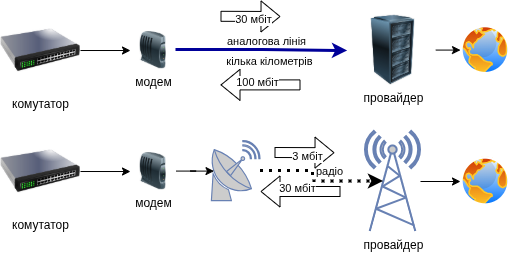

# модеми

### Що це таке?
Якщо маршрутизатор — це регулювальник, а комутатор — це перехрестя, то **модем (modem)** — це професійний перекладач.

Модем — це пристрій, який дозволяє вашій цифровій мережі (комп'ютерам) звʼязуватися через *аналоговий* сигнал, що йде по лініях зв'язку провайдера (через кабель, телефонну лінію, оптоволокно, або супутник).

Як правило, у провайдера стоїть високоякісний чутливий та потужний модем, тоді як у абонентів стоять крихітні та малопотужні абонентські термінали, через що абонентські модеми значно краще приймають сигнал переданий провайдером (наприклад 100 Мбіт), але передають значно слабший сигнал провайдеру (наприклад 30 Мбіт).

Через це, модеми як правило — це *асиметричний* вид звʼязку (працює краще в одну сторону, але гірше в іншу).

### Як він працює?

Слово "модем" — це скорочення від **MO**dulator-**DEM**odulator (модулятор-демодулятор), тобто це пристрій який модулює (наприклад змінює потужність чи фазу) аналоговий сигнал цифровим сигналом і навпаки.

Комп'ютери спілкуються лише цифровими сигналами (0 та 1). Але сигнали, які передаються через інтернет-провайдера (наприклад, по старій телефонній лінії або через кабель), часто є аналоговими (хвилями).

1. **Модуляція:** Коли ви надсилаєте дані, модем перетворює цифрові сигнали комп'ютера на аналогові хвилі, щоб вони могли "подорожувати" по кабелю.
2. **Демодуляція:** Коли ви отримуєте дані, модем приймає аналогові хвилі з лінії та перетворює їх назад у цифрові 0 та 1, які розуміє ваш комп'ютер.

### Різниця між модемом та маршрутизатором

Багато людей плутають ці пристрої, бо сучасні провайдери часто видають один пристрій, який поєднує обидва. Але це різні функції:
* **Модем:** Створює канал звʼязку по аналоговій лінії.
* **Маршрутизатор:** Звʼязує локальну мережу із зовнішнім світом по цій лінії.

## Навіщо вони потрібні?

При передачі на великі відстані, цифрові сигнали втрачають свою форму, тому наприклад гігабітний Ethernet працює на відстані всього 100 метрів. Для того щоб передати сигнал на більшу відстань, потрібно зробити так, щоб сигнали не розпливалися і не перемішувалися на далекій відстані. Цим і займається модулятор сигналу, використовуючи наприклад фазову модуляцію сигналу (як у FM-радіо). При отримані, демодулятор отримує аналоговий сигнал і перетворює його назад у цифрову форму.

**Перевага модемів** у тому, що навіть якщо відстань велика а якість лінії поганенька, модем всеодно може передавати якісь дані хоча і зі *значно меншою швидкістю*, тоді як у цифрових ліній звʼязку, звʼязок або є або відсутній повністю. Наявність повільнішого звʼязку значно краще ніж повна його відсутність.
